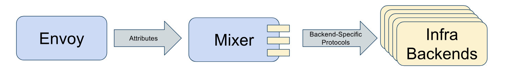
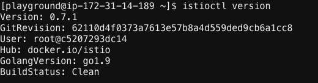
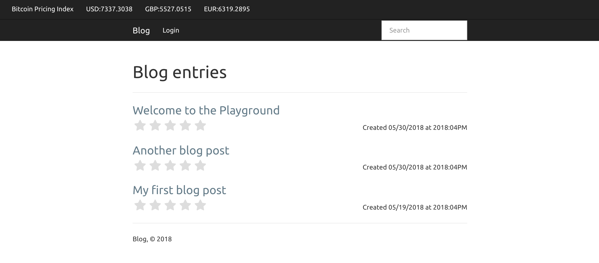
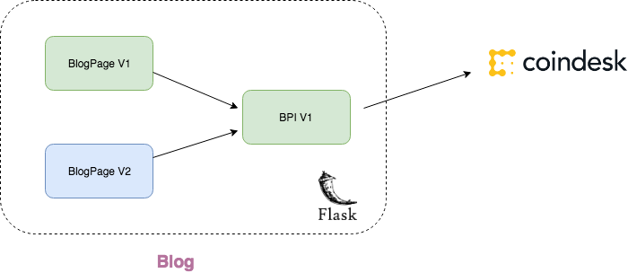
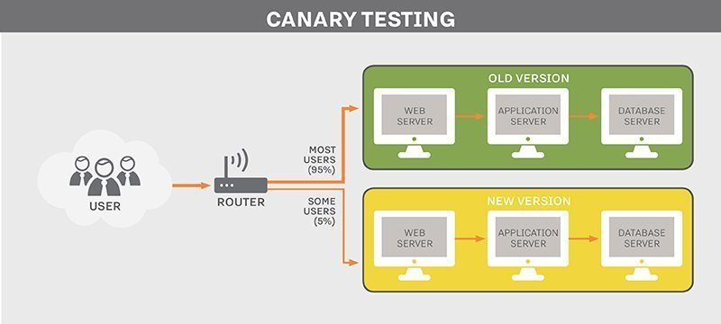

# DevOps Playground 22 - Hands on with Istio!


## What is Istio?

A service mesh that manages your network of microservices. 

Why do I need a service mesh?
- Fine grained control of the traffic.
- Permits complicated routing techniques.
- In depth Network information

Key capabilities of Istio:
- A/B testing
- Canary releases
- Failure handling
- Fault injection

All without changes to application code!


## Architecture


Split into two components:
- data plane
- control plane

Envoy proxies are deployed as sidecars that control network communication between microservices.
Control plane manages and configures the proxies to route traffic and enforces policies.

- Envoy exposes traffic behaviour as attributes e.g
```
request.path: xyz/abc
request.size: 234
request.time: 12:34:56.789 04/17/2017
source.ip: 192.168.0.1
destination.service: example
```

- Mixer is the attribute processing machine. Based on the attributes mixer can generate calls to different backends e.g. logging, telemetry.



- Pilot converts high level routing rules into Envoy specific configurations and propagates them to the sidecars. 

- Istio-Auth provides service to service and enduser authentication using mutual TLS. Upgrades unencrypted traffic & can enforce policy based on service identity rather than network controls.


## How to install Istio

The bash script below will execute the following tasks:
  - Gets the latest Istio release
  - Launches Istio stack in K8s cluster
  - Enables automatic sidecar injection
  - Labels the default namespace to enable istio sidecar injection.

1. `vi install.sh`

2. Paste the following:

```
#!/bin/bash

ISTIO_VERSION="istio-$(curl -L -s https://api.github.com/repos/istio/istio/releases/latest | \
                  grep tag_name | sed "s/ *\"tag_name\": *\"\(.*\)\",*/\1/")"

## Get latest release
cd /home/playground/
curl -L https://git.io/getLatestIstio | sh -

## Add to Path
echo "export PATH=\"\$PATH:/home/playground/${ISTIO_VERSION}/bin\"" >> ~/.bashrc

## Launch Istio stack
cd /home/playground/${ISTIO_VERSION}/
kubectl apply -f install/kubernetes/istio.yaml

## Automatic sidecar injection
# Webhooks requires a signed cert/key pair. 
./install/kubernetes/webhook-create-signed-cert.sh \
    --service istio-sidecar-injector \
    --namespace istio-system \
    --secret sidecar-injector-certs

kubectl apply -f install/kubernetes/istio-sidecar-injector-configmap-release.yaml

# Set the caBundle in the webhook install YAML
cat install/kubernetes/istio-sidecar-injector.yaml | \
     ./install/kubernetes/webhook-patch-ca-bundle.sh > \
     install/kubernetes/istio-sidecar-injector-with-ca-bundle.yaml

# Install the sidecar injector webhook.
kubectl apply -f install/kubernetes/istio-sidecar-injector-with-ca-bundle.yaml

## Label default namespace with istio-injection
kubectl label namespace default istio-injection=enabled
kubectl get namespace -L istio-injection
```

3. Give execute permissions `chmod +x install.sh`
4. Execute the script
  `./install.sh`
5. Add istioctl path to your current shell `source ~/.bashrc`
6. Ensure istioctl has been installed and configured correctly `istioctl version`

      

## Task 1: Deploy microservices

In order to tackle the Istio tasks we need a demo application to work with. Lets use this sample blog webapp.



The blog webapp is split into two microservices:
- blogpage - version1 and version 2
- bpi (bitcoin pricing index) - version1



We're going to create the following objects:
- Deployment (blogpage_v1, blogpage_v2, bpi_v1)
- Service (blogpage, bpi)
- Ingress (gateway)


1. `vi blog.yaml`

2. Paste in the following code:

    ```
    ##################################################################################################
    # BlogPage
    ##################################################################################################
    apiVersion: v1
    kind: Service
    metadata:
      name: blogpage
      labels:
        app: blogpage
    spec:
      ports:
      - port: 5000
        name: http
      selector:
        app: blogpage
    ---
    apiVersion: extensions/v1beta1
    kind: Deployment
    metadata:
      name: blogpage-v1
    spec:
      replicas: 1
      template:
        metadata:
          labels:
            app: blogpage
            version: v1
        spec:
          containers:
          - name: blogpage
            image: thiv17/blog-service:v1
            imagePullPolicy: Always
            ports:
            - containerPort: 5000
    ---
    apiVersion: extensions/v1beta1
    kind: Deployment
    metadata:
      name: blogpage-v2
    spec:
      replicas: 1
      template:
        metadata:
          labels:
            app: blogpage
            version: v2
        spec:
          containers:
          - name: blogpage
            image: thiv17/blog-service:v2
            imagePullPolicy: Always
            ports:
            - containerPort: 5000
    ---
    ##################################################################################################
    # BPI 
    ##################################################################################################
    apiVersion: v1
    kind: Service
    metadata:
      name: bpi
      labels:
        app: bpi
    spec:
      ports:
      - port: 5000
        name: http
        nodePort: 31000
      selector:
        app: bpi
      type: NodePort
    ---
    apiVersion: extensions/v1beta1
    kind: Deployment
    metadata:
      name: bpi-v1
    spec:
      replicas: 1
      template:
        metadata:
          labels:
            app: bpi
            version: v1
        spec:
          containers:
          - name: bpi
            image: thiv17/bpi-service:latest
            imagePullPolicy: Always
            ports:
            - containerPort: 5000
    ---
    ##################################################################################################
    # Ingress resource (gateway)
    ##################################################################################################
    apiVersion: extensions/v1beta1
    kind: Ingress
    metadata:
      name: gateway
      annotations:
        kubernetes.io/ingress.class: "istio"
    spec:
      rules:
      - http:
          paths:
          - path: /.*
            backend:
              serviceName: blogpage
              servicePort: 5000
    ---
    ```

3. `kubectl apply -f blog.yaml`

4. View detailed information about the pod to verify the automatic side car has been injected. 

    ```
    kubectl get pods
    kubectl describe pod <pod-name>
    ```

5. The blog application can be accessed externally but some changes have to be made to the istio ingress service.

      `kubectl edit service istio-ingress --namespace istio-system`

      Modify ```type: LoadBalancer``` 
      to 
      ```type: NodePort```

      Make a note of the http nodePort i.e: 
      ```
      ports:
        - name: http
          nodePort: 32458
      ```

      This port can also be seen mapped to port 80 using the following command: 
      
      `kubectl get service istio-ingress --namespace istio-system`

  The blog application can then be accessed using the address:

  `http://<animal>.ecs.digital:<http_nodePort>`

  i.e. `http://shrimp.ecs.digital:32458`

## Task 2: Controlling traffic

Right now you are seeing both versions of the blog page i.e. with stars and without. Without the presence of a routerule Istio simply forwards traffic to both versions of blogpage.

Lets set a default route so that we only see v1 of the blogpage

1. `vi blogpage-route-v1.yaml`

2. Paste in the following:

```
apiVersion: config.istio.io/v1alpha2
kind: RouteRule
metadata:
  name: blogpage-default
spec:
  destination:
    name: blogpage
  precedence: 1
  route:
  - labels:
      version: v1
```

3. ```istioctl create -f blogpage-route-v1.yaml```

Refresh the page and you should only see v1 (without stars) of the blogpage.

## Task 3: Canary deployment



Okay now we're only seeing v1 but what if we wanted to deploy v2 through a canary deployment? 

Of course we could take advantage of the default kubernetes deploy mechanism where we would pause during during the deployment, determine whether deployment is a success and then resume.

But imagine the scenario of having a 1% canary deployment? According to the default kubernetes way this would result in a 100 replicas :(

Lets look at the Istio method:
- Avoids relying on instance scaling
- Routing rules control traffic distribution
- Allows focused canary testing.

1. `vi blogpage-route-weighted.yaml`

2. Paste in the following

```
apiVersion: config.istio.io/v1alpha2
kind: RouteRule
metadata:
  name: blogpage-weighted
spec:
  destination:
    name: blogpage
  precedence: 2
  route:
  - labels:
      version: v1
    weight: 80
  - labels:
      version: v2
    weight: 20
```
3. `istioctl create -f blogpage-route-weighted.yaml`

Refresh the page and on average every 2 out of 10 times blogpage v2 (with stars) should appear.


## Task 4: Managing egress traffic

One of the key features of Istio is that 
all egress traffic is blocked by default. This is because by default all outbound traffic is redirected to the sidecar proxy which only handles intra-cluster destinations.

There are two ways to control egress traffic:
- whitelisting
- calling directly

Lets explore whitelisting:

1. The BPI service is exposed on:

    `http://<animal>.ecs.digital:31000`


    or can be seen on the navbar of the blogpage:

    `http://<animal>.ecs.digital:<http_nodePort>`

2. Apply the egress rule:


    ```
    vi bpi-egressrule.yaml
    ```

    Paste the following:
    ```
    apiVersion: config.istio.io/v1alpha2
    kind: EgressRule
    metadata:
      name: coindesk-egress-rule
    spec:
      destination:
        service: api.coindesk.com
      ports:
        - port: 80
          protocol: http
    ```

    ```
    istioctl create -f bpi-egressrule.yaml
    ```

    This rule whitelists the domain: api.coindesk.com on http protocol & port 80.

3. Refresh either the blogpage or the BPI service directly.


## Task 5: Focused Canary testing

This final task we're going to work with a similar web application.
But first lets clear all the deployments and routing rules that have been created:

1. Delete routing rules 
    ```
    istioctl delete -f blogpage-route-v1.yaml
    istioctl delete -f blogpage-route-weighted.yaml 
    istioctl delete -f bpi-egressrule.yaml
    ```

2. Delete blog services and deployments
    ```
    kubectl delete -f blog.yaml
    ```

3. Launch bookinfo stack:
    ```
    kubectl apply -f istio-0.7.1/samples/bookinfo/kube/bookinfo.yaml
    ```

4. Ensure bookinfo stack is visible at `http://<animal>.ecs.digital:<http_nodePort>/productpage`. If you refresh a couple of times you should see different versions of the reviews microservice appear.
    - v1: doesn't have the stars feature.
    - v2: black stars
    - v3: red stars

5. Set default version for all microservices to v1.
   ```
   istioctl create -f istio-0.7.1/samples/bookinfo/kube/route-rule-all-v1.yaml
   ```
    If you visit the page now there shouldn't be any stars appearing.

6. Now route a specific user to reviews: v2
    ```
    istioctl create -f istio-0.7.1/samples/bookinfo/kube/route-rule-reviews-test-v2.yaml
    ```

    Contents of the yaml:
    ```
    apiVersion: config.istio.io/v1alpha2
    kind: RouteRule
    metadata:
      name: reviews-test-v2
    spec:
      destination:
        name: reviews
      precedence: 2
      match:
        request:
          headers:
            cookie:
              regex: "^(.*?;)?(user=jason)(;.*)?$"
      route:
      - labels:
          version: v2
    ```

7. Login in as user `jason`. You should now see ratings appear next to each review, but any other user e.g. `admin` will see only reviews: v1


## Task 6: Simulating Failure

While forwarding the request to the destination Istio can inject either delays or aborts.

1. Delete all previous rules
    ```
    istioctl delete -f istio-0.7.1/samples/bookinfo/kube/route-rule-all-v1.yaml
    istioctl delete -f istio-0.7.1/samples/bookinfo/kube/route-rule-reviews-test-v2.yaml
    ```

2. `vi ratings-abort.yaml`

3. Paste the following
    
    ```
    apiVersion: config.istio.io/v1alpha2
    kind: RouteRule
    metadata:
      name: ratings-abort
    spec:
      destination:
        name: ratings
      route:
      - labels:
          version: v1
      httpFault:
        abort:
          percent: 100
          httpStatus: 400
    ```

4. `istioctl create -f ratings-abort.yaml`

5. View the product page and the ratings service should display that it is currently unavailable. 
